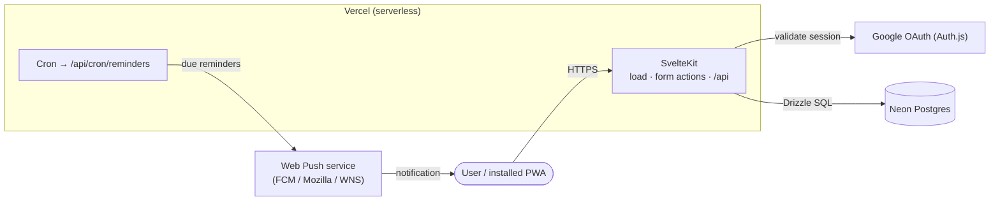

<div align="center">

# 🌱 Rootine

**One habit tracker that replaces three apps** — habits, plants, and workouts — wrapped in a calm, editorial, garden-inspired interface.


</div>

---

## Overview

Rootine is a **mobile-first PWA habit tracker** built on a single polymorphic data model: habits, plant-watering, and workouts are all _activities_, differentiated by a `type` and a JSONB config — no separate tables per kind. Completing activities grows a procedural **underground root system**, turning consistency into something you can watch take root.

The interface follows a "Grounded Gallery" design language — organic shapes, editorial serif/sans pairing, earthy tones, and tonal layering instead of hard borders (see [DESIGN.md](DESIGN.md)).

## Features

- **Three activity types, one model** — Habits (counters with targets), Plants (interval watering), Workouts (exercise templates).
- **Flexible scheduling** — daily, specific weekdays, or rolling intervals; per-day targets and units.
- **Workout sessions** — named exercise sets, automatic [rotation](docs/features/workout-habits.md), week-shifting when life gets in the way, and make-up / backfill for missed days.
- **Root-system garden** — a derived, deterministic [underground tree](docs/features/root-system-garden.md) on the Roots page: one offshoot per habit, length tracking its completions, milestone blooms, and optimistic growth on completion.
- **Streaks** — local-day streak with a one-day grace window.
- **Push reminders** — per-habit reminder times delivered via [Web Push](docs/features/push-notifications.md), dispatched in each device's timezone.
- **Installable PWA** — single service worker (workbox `injectManifest`), app precache, prompt-based updates.
- **Crafted UX** — light / dark / system themes, configurable haptics, native-feeling mobile drawers.

> [!NOTE]
> **Offline support is a work in progress.** The app is installable and precaches its shell/assets (so it loads without a connection), but the **offline action queue is not implemented yet** — there is no IndexedDB write-behind or background sync. Completing activities currently requires connectivity; the optimistic offline-first flow sketched in [docs/architecture.md](docs/architecture.md) is the intended design, not the current behaviour.

### Activity types

| Type        | Tracks                          | Example                       | Schedule default     |
| ----------- | ------------------------------- | ----------------------------- | -------------------- |
| **Habit**   | A counter toward a daily target | "Drink water" × 3             | Daily                |
| **Plant**   | A rolling watering interval     | "Monstera" every 7 days       | Interval             |
| **Workout** | Exercise templates + rotation   | "Push / Pull / Legs" rotation | Weekly (Mon/Wed/Fri) |

## Tech stack

| Layer          | Choice                                                                                                                  |
| -------------- | ----------------------------------------------------------------------------------------------------------------------- |
| Framework      | [SvelteKit 2](https://svelte.dev/docs/kit) · Svelte 5 (runes) · TypeScript (strict)                                     |
| Styling        | Tailwind CSS v4 · `bits-ui` (shadcn-svelte-style components) · `vaul-svelte` drawers · Lucide icons                     |
| Forms & schema | `sveltekit-superforms` · Zod 4 (also validates JSONB at the boundary)                                                   |
| Data           | Drizzle ORM · [Neon](https://neon.tech) serverless Postgres                                                             |
| Auth           | Auth.js (`@auth/sveltekit`) — Google OAuth                                                                              |
| Dates          | `date-fns` · `@internationalized/date` (timezone-aware "today", see [ADR 007](docs/decisions/007-timezone-handling.md)) |
| PWA / push     | `@vite-pwa/sveltekit` (`injectManifest`) · `web-push` (VAPID)                                                           |
| Testing        | Vitest (unit) · Playwright (e2e)                                                                                        |
| Hosting        | Vercel (serverless) · cron for reminders                                                                                |

## Architecture

A single-page PWA (`ssr = false`) backed by SvelteKit server `load`/`actions` and API routes running serverless on Vercel.



More detail and the decision records live in [`docs/`](docs/) — start with [docs/architecture.md](docs/architecture.md).

## Getting started

### Prerequisites

- Node.js 20+
- A Neon (or any) Postgres database URL
- A Google OAuth client (for sign-in)

### Setup

```sh
git clone https://github.com/<you>/rootine.git
cd rootine
npm install
cp .env.example .env   # then fill in the values below
```

Required environment variables (`.env`):

| Variable                                    | Purpose                                                  |
| ------------------------------------------- | -------------------------------------------------------- |
| `DATABASE_URL`                              | Neon/Postgres connection string                          |
| `AUTH_SECRET`                               | Auth.js secret (`openssl rand -hex 32`)                  |
| `GOOGLE_CLIENT_ID` / `GOOGLE_CLIENT_SECRET` | Google OAuth credentials                                 |
| `PUBLIC_VAPID_PUBLIC_KEY`                   | Web Push public key (`npx web-push generate-vapid-keys`) |
| `VAPID_PRIVATE_KEY`                         | Web Push private key (**server-only**)                   |
| `VAPID_SUBJECT`                             | `mailto:` contact for the push service                   |
| `CRON_SECRET`                               | Guards `/api/cron/reminders`                             |

> Only `PUBLIC_`-prefixed vars reach the browser. Keep `VAPID_PRIVATE_KEY` and `CRON_SECRET` unprefixed.

### Database

Schema is managed with **`drizzle-kit push`**:

```sh
npm run db:push     # syncs src/lib/server/db/schema.ts to the database
```

> [!WARNING]
> `npm run db:migrate` is a **no-op** here — the `@neondatabase/serverless` HTTP driver can't run drizzle-kit's transactional migrations (it exits cleanly without applying anything). Use `db:push`.

### Develop

```sh
npm run dev          # http://localhost:8007
```

### Test the PWA / service worker

The dev server's worker is module-type and registers inconsistently across browsers, so test push/PWA against a production build:

```sh
npm run build && npm run preview   # http://localhost:4173
```

> **Windows:** the build creates symlinks via the Vercel adapter. Enable **Settings → Privacy & security → For developers → Developer Mode** once (restart the terminal) or `npm run build` fails with `EPERM … symlink`. `npm run preview` is unaffected.

## Scripts

| Script              | Does                                             |
| ------------------- | ------------------------------------------------ |
| `npm run dev`       | Vite dev server                                  |
| `npm run build`     | Production build                                 |
| `npm run preview`   | Serve the production build (use for PWA testing) |
| `npm run check`     | `svelte-check` type checking                     |
| `npm run lint`      | Prettier check + ESLint                          |
| `npm run format`    | Prettier write                                   |
| `npm run test:unit` | Vitest                                           |
| `npm run test:e2e`  | Playwright                                       |
| `npm run db:push`   | Sync schema to the database                      |
| `npm run db:studio` | Drizzle Studio                                   |

## Project structure

```
src/
├─ routes/
│  ├─ (app)/            # dashboard + roots (root-system garden)
│  ├─ (workout)/        # workout session focus mode
│  ├─ (auth)/           # login
│  └─ api/
│     ├─ push/          # subscribe / unsubscribe
│     └─ cron/reminders # reminder dispatcher
├─ lib/
│  ├─ server/           # db (Drizzle), auth, dashboard/garden queries, push sender
│  ├─ components/       # activity, root-system, layout, ui
│  ├─ types/            # Zod schemas (the polymorphic model)
│  ├─ scheduler.ts      # isScheduledForDate (daily/weekly/interval + week shifts)
│  ├─ roots.ts          # deterministic garden generator
│  └─ push.ts           # client Web Push helpers
├─ service-worker.ts    # injectManifest worker (precache + push + notificationclick)
└─ app.d.ts
```

## Documentation

- [Architecture](docs/architecture.md)
- Decisions (ADRs): [SPA mode](docs/adr/001-spa-mode-for-pwa.md) · [Superforms](docs/decisions/005-why-sveltekit-superforms.md) · [Service worker strategy](docs/decisions/006-service-worker-strategy.md) · [Timezone handling](docs/decisions/007-timezone-handling.md)
- Features: [Workout habits](docs/features/workout-habits.md) · [Root-system garden](docs/features/root-system-garden.md) · [Push notifications](docs/features/push-notifications.md)
- [Design system](DESIGN.md)

## Deployment

Deploys to **Vercel** (`@sveltejs/adapter-vercel`). Set the environment variables above in the project settings, then:

- **Database:** run `npm run db:push` against the production `DATABASE_URL` (the build's `db:migrate` step is a no-op — see above).
- **Reminders:** [`vercel.json`](vercel.json) registers a once-daily cron as a safety net. Because Vercel Hobby caps cron at once/day, the real ~15-minute cadence comes from an external scheduler (e.g. cron-job.org) hitting `/api/cron/reminders` with `Authorization: Bearer <CRON_SECRET>`. See [push notifications](docs/features/push-notifications.md#3-cron-schedule).

## Roadmap

- 🚧 **Offline-first** — IndexedDB write-behind queue + background sync (installable shell already ships).
- Stats & history — completion heatmap, streak history.
- Above-ground garden rewards, shareable garden snapshot.
- Streak freeze / repair.

## License

[MIT](LICENSE) © 2025 Vojtěch Marek
