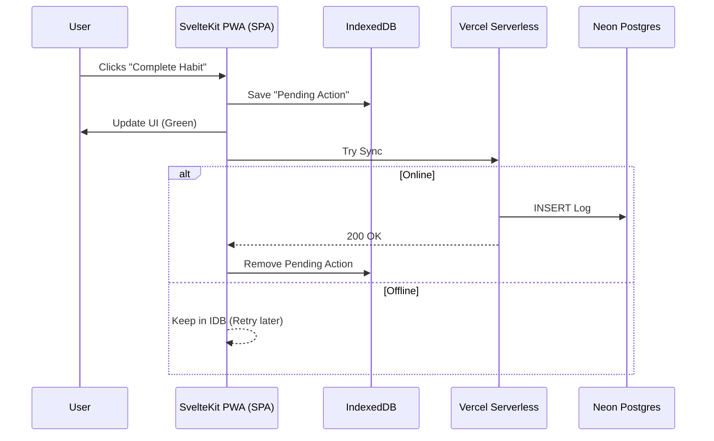

# Architecture

## Sequence Diagram

## Architectural Decisions
All major architectural decisions are documented in the `docs/adr` folder.
- [ADR 001: Transition to Single Page Application (SPA) Mode for PWA](./adr/001-spa-mode-for-pwa.md)
