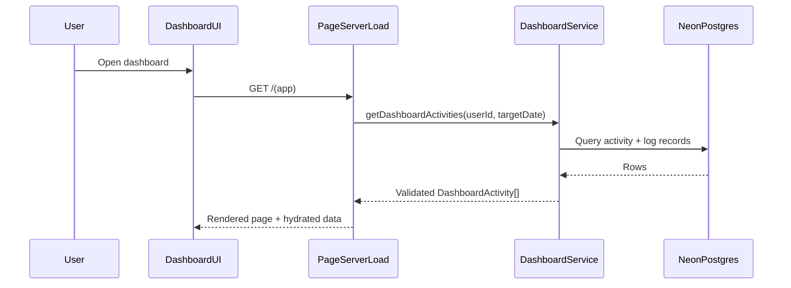
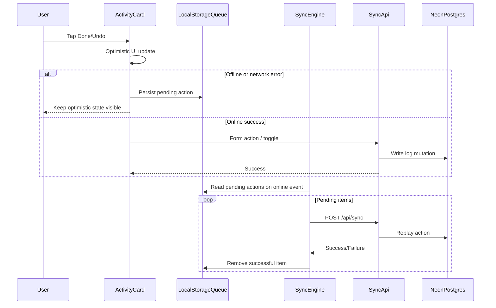

# Rootine Architecture

## System Overview

Rootine uses a server-rendered SvelteKit application with progressive enhancement for mutations and a mobile-first UI shell.

- Frontend: SvelteKit + Svelte 5 runes + Tailwind + shadcn-svelte components.
- Backend: SvelteKit server load functions and form actions.
- Database: Neon Postgres through Drizzle ORM.
- Validation: Zod for form boundaries and polymorphic JSONB payloads.
- Auth: Auth.js session-based flow in server hooks.

## Core Data Model

Rootine follows a polymorphic model:

- `activity` table stores all activity types (`habit`, `plant`, `workout`) in one place.
- `log` table stores completion history with a generic JSONB `data` blob.
- Zod discriminated unions are the source of truth for valid activity and log payload shapes.

## Dashboard Request Flow

## Offline Sync Engine (Habit Completion Reliability)

To prevent data loss when connectivity drops, habit toggles use an offline-first sync pipeline:

### Sync Responsibilities

- `src/lib/components/activity/ActivityCard.svelte`: optimistic UI and queue fallback.
- `src/lib/sync/queue.ts`: localStorage persistence and queue operations.
- `src/lib/sync/network.svelte.ts`: online/offline reactive state.
- `src/lib/sync/engine.svelte.ts`: replay orchestration on reconnect.
- `src/routes/api/sync/+server.ts`: authenticated server endpoint for replaying queued actions.

### Consistency Model

- Optimistic updates are immediate on user interaction.
- Local queue is the durability layer during offline periods.
- Reconnection triggers replay in FIFO order.
- Successful replay removes the local pending action.
- `invalidateAll()` refreshes dashboard state after replay to align client/server truth.
