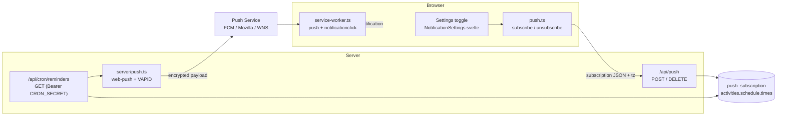
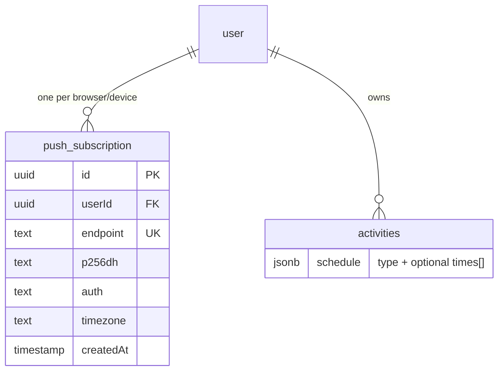
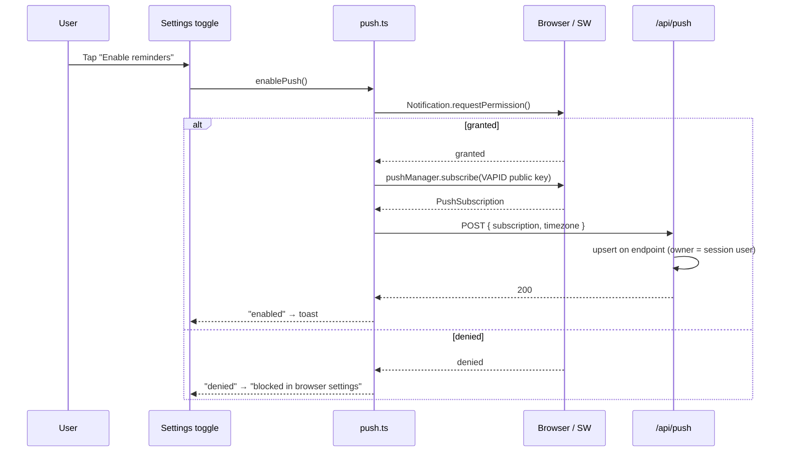
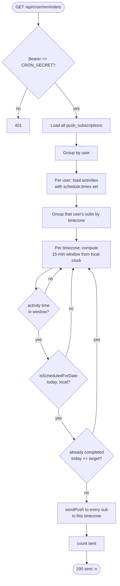

# Push Notifications — Per-Device Opt-In & Per-Habit Reminders

Web Push reminders built on the existing service worker ([ADR 006](../decisions/006-service-worker-strategy.md)).
Two user-facing capabilities:

- **Enable notifications** — a per-device toggle in Settings that subscribes the browser to Web Push.
- **Per-habit reminders** — each daily/weekly activity can carry one or more reminder times; a cron
  job fans out a notification at each time, in the device's own timezone, unless the habit is already done.

---

## Moving Parts



| Concern               | File                                                    |
| --------------------- | ------------------------------------------------------- |
| Delivery + click      | `src/service-worker.ts` (`push`, `notificationclick`)   |
| Client subscribe flow | `src/lib/push.ts`                                       |
| Settings UI           | `src/lib/components/layout/NotificationSettings.svelte` |
| Subscription storage  | `src/routes/api/push/+server.ts`                        |
| Reminder times UI     | `src/lib/components/activity/ScheduleFields.svelte`     |
| Dispatcher (cron)     | `src/routes/api/cron/reminders/+server.ts`              |
| Server sender         | `src/lib/server/push.ts`                                |

---

## Data Model



`push_subscription` — one row per browser/device subscription. A user may have several (phone PWA,
desktop). Keyed on the push service `endpoint` (unique); re-subscribing the same browser upserts.

| Field      | Type | Notes                                                                                                                              |
| ---------- | ---- | ---------------------------------------------------------------------------------------------------------------------------------- |
| `endpoint` | text | Unique. The push service URL; also the delete key.                                                                                 |
| `p256dh`   | text | Client public key for payload encryption.                                                                                          |
| `auth`     | text | Client auth secret for payload encryption.                                                                                         |
| `timezone` | text | IANA name captured **at subscribe time** so the cron evaluates reminder times against the device's local clock. Defaults to `UTC`. |

**Reminder times** live on the existing `activities.schedule` JSONB — no schema change. Only the
`daily` and `weekly` schedule variants carry an optional `times: string[]` (`"HH:mm"`, 24h):

```ts
// src/lib/types/schemas.ts — ScheduleSchema
{ type: 'daily',  times?: ["09:00", "21:00"] }
{ type: 'weekly', days: [...], times?: ["07:30"] }
{ type: 'interval', value, unit }   // no reminders (plants/chores)
```

> **First deploy:** run `npm run db:push` to create the `push_subscription` table (same convention as
> the `week_exception` table — see [Workout Habits](./workout-habits.md)). `db:migrate` is a **no-op**
> on this project: the `@neondatabase/serverless` HTTP driver can't run drizzle-kit's transactional
> migrations, so it exits cleanly without applying anything. The `drizzle/0001_push_subscription.sql`
> file is kept as a record of the schema change, but `db:push` (which diffs `schema.ts` against the DB)
> is what actually applies it.

---

## Enabling Notifications (per device)

Permission and the `PushManager` subscription are **per browser/device**, so the toggle reflects the
state of the current device only.



- **Status** is derived live (`getPushStatus`): `unsupported` (no SW/PushManager/Notification),
  `denied` (permission blocked), `enabled` (active subscription exists), or `disabled`.
- **Disable** unsubscribes locally (`subscription.unsubscribe()`) and `DELETE /api/push` removes the
  row, scoped to `(userId, endpoint)`.
- **VAPID public key** is read on the client from `PUBLIC_VAPID_PUBLIC_KEY` and converted from base64url
  to the `Uint8Array` the Push API requires.

---

## Reminder Dispatch (cron)

`GET /api/cron/reminders` is hit every 15 minutes. It is authorized by an
`Authorization: Bearer ${CRON_SECRET}` header and **fails closed** (401) when `CRON_SECRET` is unset.



Why the shape:

- **Per-timezone evaluation.** A user's reminder at `09:00` should fire at 09:00 _local_ to each
  device. Subscriptions are grouped by their stored `timezone`; the local wall clock is computed with
  `Intl` and floored to the current 15-minute bucket (`windowStartInTimezone`). A reminder fires when
  its `"HH:mm"` falls in `[windowStart, windowStart + 15)`.
- **Local "today" reuses ADR 007 helpers.** The schedule check and the "already done" check both bucket
  by the device's local day via `tzTodayString` / `tzTodayDate` (`src/lib/utils/date.ts`) — the same
  DST-correct bucketing the dashboard uses, instead of the UTC host clock.
- **Schedule-aware.** `isScheduledForDate` is reused, so weekly day membership **and** current-week
  `WeekException` shifts ([Workout Habits](./workout-habits.md)) are honoured — a shifted habit reminds
  on the shifted day.
- **Suppress when done.** Logs from the last 24h are bucketed to the local day; if completions already
  meet the target (`config.targetValue` for habits, else 1), no reminder is sent.
- **Self-healing subscriptions.** `sendPush` deletes any subscription the push service reports as gone
  (404/410), so dead devices stop being retried.

---

## Setup & Configuration

### 1. Environment variables

| Variable                  | Where           | Purpose                                                                        |
| ------------------------- | --------------- | ------------------------------------------------------------------------------ |
| `PUBLIC_VAPID_PUBLIC_KEY` | client + server | VAPID public key (base64url). Public — shipped to the browser.                 |
| `VAPID_PRIVATE_KEY`       | server          | VAPID private key. **Secret.**                                                 |
| `VAPID_SUBJECT`           | server          | `mailto:` or `https:` contact for the push service. Defaults to a placeholder. |
| `CRON_SECRET`             | server          | Shared secret guarding `/api/cron/reminders`. Without it the route is 401.     |

Generate a VAPID keypair (the public/private pair must match):

```sh
npx web-push generate-vapid-keys --json
```

Dev keys are already in `.env`; `.env.example` documents the full set. **Generate a fresh keypair for
production** and set all four vars in the Vercel project settings.

### 2. Database

```sh
npm run db:push   # diffs schema.ts against the DB and creates push_subscription
```

Use `db:push`, **not** `db:migrate` — the `@neondatabase/serverless` HTTP driver can't run drizzle-kit's
transactional migrations, so `db:migrate` exits 0 without applying anything (verify with
`SELECT to_regclass('public.push_subscription')`). This is the same convention the rest of the schema
already follows.

> **Production note:** `vercel.json`'s build runs `npm run db:migrate`, which is the same no-op against
> Neon — so a deploy will **not** create this table on its own. Run `npm run db:push` against the
> production `DATABASE_URL` (or otherwise apply the SQL) before relying on push in prod.

### 3. Cron schedule

The reminder window is 15 minutes ([`WINDOW_MINUTES`](../../src/routes/api/cron/reminders/+server.ts)),
so for reminders to land near their set time the dispatcher must run **every ~15 minutes**. Vercel Hobby
caps cron at **once per day**, so the real cadence comes from an **external scheduler** and `vercel.json`
keeps only a once-daily safety net:

```json
"crons": [{ "path": "/api/cron/reminders", "schedule": "0 21 * * *" }]
```

> Vercel cron schedules are **UTC** — `0 21 * * *` is 21:00 UTC. When `CRON_SECRET` is set in the Vercel
> project, Vercel automatically attaches the `Authorization: Bearer <CRON_SECRET>` header to its
> invocations.

**External scheduler (the real driver):** point a service like [cron-job.org](https://cron-job.org) at
`https://<your-domain>/api/cron/reminders` every 15 minutes, with header
`Authorization: Bearer <CRON_SECRET>`. The endpoint accepts any caller with the right secret, so the
external scheduler and Vercel's daily run use the exact same path. A reminder time only fires inside its
own 15-minute window, so a slower external interval will simply miss some windows.

### 4. Testing locally

The service worker only registers in a built app, not `vite dev`:

```sh
npm run build && npm run preview
```

1. Settings → **Enable reminders** (grant the permission prompt).
2. Add a reminder time on a habit a few minutes ahead.
3. Trigger the dispatcher manually:

```sh
curl -H "Authorization: Bearer dev-cron-secret" http://localhost:4173/api/cron/reminders
# → {"sent":1}
```

---

## Edge Cases

| Scenario                               | Behaviour                                                                         |
| -------------------------------------- | --------------------------------------------------------------------------------- |
| Browser without Push/Notification API  | Toggle shows "not supported"; no subscribe attempt.                               |
| Permission denied / blocked            | Toggle returns `denied`; hint to unblock in browser settings.                     |
| Same browser re-subscribes             | Upsert on `endpoint` — refreshes keys/timezone, reassigns to current user.        |
| Multiple devices                       | One row each; a reminder fans out to every subscription in the matching timezone. |
| Subscription expired/revoked           | `sendPush` gets 404/410 → row deleted, no further retries.                        |
| Habit already completed today          | Suppressed (`doneCount >= target`, bucketed by device local day).                 |
| `interval` schedule (plants/chores)    | No `times` field → never reminded. UI hides the reminders section.                |
| Weekly habit, week shifted             | Reminds on the shifted day (`isScheduledForDate` + `WeekException`).              |
| Reminder time not on a scheduled day   | Not sent — schedule check runs after the time-window check.                       |
| Invalid stored timezone                | That timezone group is skipped for the run; others still process.                 |
| Missed cron window (downtime)          | Reminders in the missed window are dropped, not replayed — avoids stale spam.     |
| `CRON_SECRET` unset                    | `/api/cron/reminders` returns 401 (fails closed).                                 |
| Cron retried within same 15-min bucket | Possible duplicate send; acceptable for a low-volume app (no per-send dedup).     |

---

## Future Work

- **Per-subscription mute / quiet hours** — currently all-or-nothing per device.
- **Dedup ledger** — a `sent` record keyed by `(activityId, localDay, time)` to make dispatch
  idempotent across cron retries and overlapping schedulers.
- **Batched queries** — the dispatcher loops per user (N+1); fine for a single/few-user app, revisit at scale.
