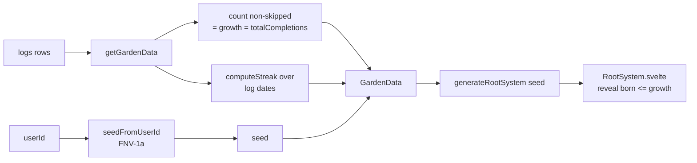
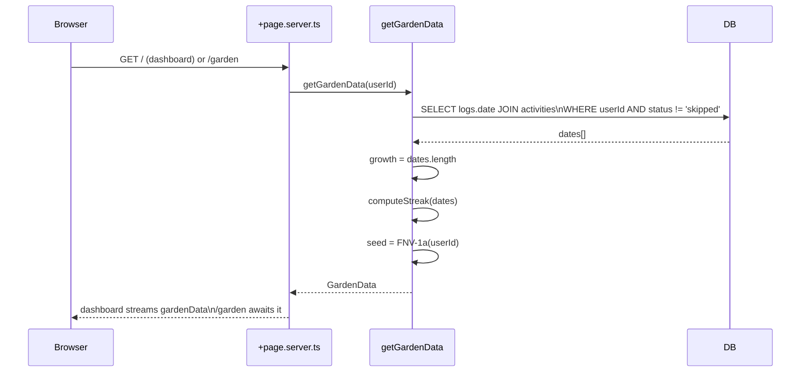
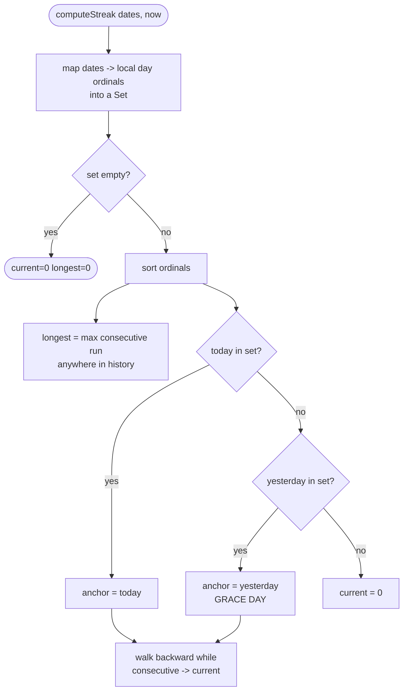

# Root System — Gamified Garden

A single procedural "plant" that grows as the user completes activities. The root
system below the soil is the reward surface; the more you do, the more of it is
revealed. Layered on top: a **streak** metric (consecutive active days).

- **Garden widget** — a non-interactive preview embedded in the dashboard.
- **Garden route** (`/garden`) — the full, pan/zoom-able view with stats.
- **Streak** — first streak primitive in the app (none existed before).

> **Status:** v1 prototype wired to live data. See
> [Notes & v1 Review Backlog](#notes--v1-review-backlog) for everything
> deliberately deferred.

---

## Core Idea — Derive, Don't Persist

The generator (`src/lib/roots.ts`) is **pure and deterministic**: a `seed`
produces one fixed plant, and `growth` reveals it gradually. Its docstring says
you "only need to persist `{ seed, growth }`." We go one step further and **derive
both** — so the feature adds **zero tables and zero columns**.

| Quantity | Source | Why it's safe |
| -------- | ------ | ------------- |
| `seed` | FNV-1a hash of `userId` | Stable for a user forever → plant shape never changes. |
| `growth` | Count of non-skipped `logs` | Monotonic; raising growth only _adds_ segments, never mutates existing ones. |
| `currentStreak` / `longestStreak` | Pure function over log dates | Recomputed each load; no drift possible. |



Because generation depends **only** on the seed, the segment array is stable as
`growth` rises — Svelte plays the draw-in transition on each newly revealed path.

---

## Data Flow

No schema change. `getGardenData` joins `logs → activities` and counts.



`GardenData` shape (`src/lib/server/garden.ts`):

| Field | Type | Description |
| ----- | ---- | ----------- |
| `seed` | `number` | 32-bit FNV-1a of `userId`. Determines plant shape. |
| `growth` | `number` | Lifetime non-skipped completions. Drives reveal. |
| `totalCompletions` | `number` | Same value, surfaced as a stat. |
| `currentStreak` | `number` | Consecutive active days (1-day grace). |
| `longestStreak` | `number` | Best run ever. |

**Skipped logs are excluded** — they record intent, not work. This mirrors the
dashboard's `logCountToday` counting (`status !== 'skipped'`).

---

## Streak Logic

Pure, unit-tested (`src/lib/streak.ts`, `streak.spec.ts`). Operates on a flat
list of completion dates; dedupes per local calendar day.



**Grace window:** the current streak stays alive while **today _or_ yesterday**
has a completion — so it doesn't collapse to 0 the moment you wake up before
logging. It only breaks once a full day passes with nothing.

| Completion days (relative to today) | `current` | Note |
| ----------------------------------- | --------- | ---- |
| today, −1, −2 | 3 | normal |
| −1, −2 (nothing today yet) | 2 | grace day keeps it alive |
| −2, −3 (today & yesterday missed) | 0 | broken |
| today ×3 (dupes same day) | 1 | deduped |

All math is **day-granular, local time**, via `Date.UTC(y, m, d)` ordinals — so a
completion at 23:59 and one at 00:01 the next day count as two days.

---

## UI

```mermaid
flowchart TD
    subgraph Dashboard
      W[GardenWidget\nstreamed promise]
    end
    subgraph Route[/garden/]
      F[Garden interactive\n+ stat cards + Fit]
    end
    W -- click / Expand --> Route
    W --> G1[Garden.svelte\ninteractive=false]
    F --> G2[Garden.svelte\ninteractive=true]
    G1 --> RS[RootSystem.svelte]
    G2 --> RS
```

- **`Garden.svelte`** — thin wrapper: `generateRootSystem(seed)` → `RootSystem`,
  forwards `fitToView()`.
- **`GardenWidget.svelte`** — dashboard card. Awaits the streamed `gardenData`
  (never blocks the activity list), shows a streak chip, renders a static
  preview, whole thing is a button → `/garden`.
- **`/garden/+page.svelte`** — full view: interactive RootSystem, three stat
  cards (current streak / longest streak / completions), a **Fit** button.
- **`RootSystem.svelte`** — gained an **`interactive`** prop. When `false`:
  wheel-zoom / drag-pan effect is skipped and root hit-testing is disabled
  (`pointer-events: none`), so clicks fall through to the wrapping Expand button.

**Soil backdrop:** RootSystem's earthy palette is designed for a dark background.
Both surfaces supply a fixed `#2a2118 → #120c06` gradient so colors read
correctly regardless of the app's light/dark theme.

### Navigation

`/garden` added to the bottom nav (`Sprout` icon), between Dashboard and the
still-disabled Stats/Profile items.

---

## Files

| File | Role | New / Changed |
| ---- | ---- | ------------- |
| `src/lib/roots.ts` | Procedural generator | unchanged (prototype) |
| `src/lib/streak.ts` | Pure streak math | **new** |
| `src/lib/streak.spec.ts` | Streak tests (7) | **new** |
| `src/lib/server/garden.ts` | `getGardenData` rollup | **new** |
| `src/lib/components/root-system/RootSystem.svelte` | Renderer | changed (`interactive` prop) |
| `src/lib/components/root-system/Garden.svelte` | seed → segments wrapper | **new** |
| `src/lib/components/root-system/GardenWidget.svelte` | Dashboard preview | **new** |
| `src/routes/(app)/garden/+page.{server.ts,svelte}` | Full view | **new** |
| `src/lib/components/layout/Navigation.svelte` | Nav item | changed |
| `src/routes/(app)/+page.server.ts` | Stream `gardenData` | changed |
| `src/lib/components/activity/Dashboard.svelte` | Embed widget | changed |

> **No `db:push` required** — this feature touches no schema.

---

## Edge Cases

| Scenario | Behaviour |
| -------- | --------- |
| Brand-new user, 0 completions | `growth = 0` → only the above-ground sprout renders. Empty/"plant a seed" state. |
| Only skipped logs | Excluded → `growth = 0`, `streak = 0`. Skips don't grow the plant. |
| Huge completion count (> `maxSteps` 72) | Whole system revealed; `growth` keeps rising harmlessly. Thickness caps at `maxGrowth` (60). |
| Multiple completions same day | Grow plant by N (each log = +1 growth); streak counts the day once. |
| Backfilled completion (past day, current ISO week) | Counts toward `growth`; streak reflects the backfilled day's ordinal. |
| Undo a completion | `growth` drops by 1 on next load; a revealed tip segment disappears (reversible by design). |
| Garden query fails on dashboard | Widget shows "Garden unavailable"; activity list unaffected (separate streamed promise). |
| Late-night completions across midnight | Counted as two distinct streak days (local ordinal boundary). |

---

## Notes & v1 Review Backlog

Everything below is **intentionally deferred** — revisit after dogfooding v1.

### Known limitations / design gaps

- **Roots are not mapped to habits.** `roots.ts` generates `rootId` per
  internal branch, _not_ per activity. The "one root ≈ one habit" comment in the
  generator is aspirational. Consequence: `onselect(rootId)` cannot open a
  specific habit, and roots don't carry per-activity color. The plant currently
  represents the _whole_ practice, not individual habits.
  - _To fix:_ seed/generate one sub-tree per activity (e.g. per `activity.id`),
    tag segments with the owning `activityId`, then `describe`/`onselect` can map
    back to real habits and tint roots with `activity.color`.

- **Roots ignore activity accent colors.** Palette is hard-coded browns
  (`--root-0..3` in `RootSystem.svelte`). Tinting needs the per-habit mapping
  above first.

- **`growth = raw completion count`.** Linear and uncapped. May feel slow for
  heavy users and there's no "prestige"/reset. Consider a curve
  (e.g. `growth = f(totalCompletions, currentStreak)`) so streaks visibly
  accelerate growth.

- **Streak counts _any_ completion day**, not "all scheduled activities done."
  Simpler and robust, but a perfectionist streak ("perfect day") would need
  per-day schedule evaluation over history (expensive). Decide which semantic we
  want before users anchor on the current one.

- **Streak has no timezone awareness beyond server local time.** `getGardenData`
  runs `computeStreak(dates)` with the server's `new Date()`. A user in a far TZ
  could see the grace window flip a few hours early/late. Thread the user's TZ
  (or compute streak client-side) if this matters.

- **Full query, no pagination.** `getGardenData` pulls _all_ non-skipped log
  dates every load. Fine at current scale; for power users with thousands of
  logs, switch to a SQL `count(*)` for growth + a windowed date scan (or a
  materialized `daily_activity` rollup) for streak.

- **No caching.** Recomputed on every dashboard + `/garden` load. Cheap now;
  candidate for a short-TTL cache or a derived column if it shows up in traces.

### Possible enhancements (post-v1)

- **Milestones / blooms.** Trigger an above-ground flower or visual flourish at
  streak/growth thresholds (7-day, 30-day, 100 completions).
- **Per-habit roots + click-through** (depends on the mapping fix) — tap a root
  to jump to that activity's detail.
- **Shareable garden snapshot** (SVG/PNG export) for social proof.
- **Streak freeze / repair** mechanic (spend nothing, or a limited "skip token")
  to forgive one missed day — common retention pattern.
- **Animated growth on completion** — when a log is created, optimistically bump
  `growth` and play the new tip's draw-in without a full reload.
- **Stats page integration** — the disabled `/stats` nav item could host streak
  history, a completion heatmap, and longest-run records alongside the garden.
- **Seasonal / theme variants** of the soil + palette.
- **Persist `{ seed, growth }`** _only if_ we later want growth to diverge from
  raw completion count (e.g. decay, prestige) — at that point derivation no
  longer suffices and a `garden_state` row becomes worth it.

### Open questions for review

1. Is "any completion = active day" the streak semantic we want, or "perfect
   day"?
2. Should growth be linear, or accelerate with streak?
3. Do we want per-habit roots in v2, or keep the unified-plant model?
4. Where should the streak surface besides `/garden` — header chip? toast on
   completion?
