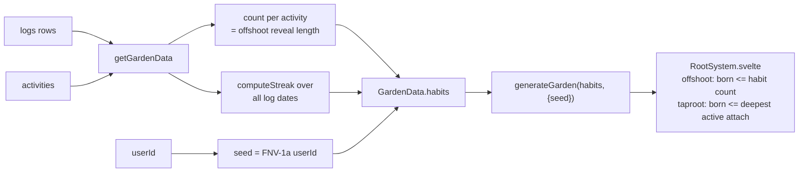
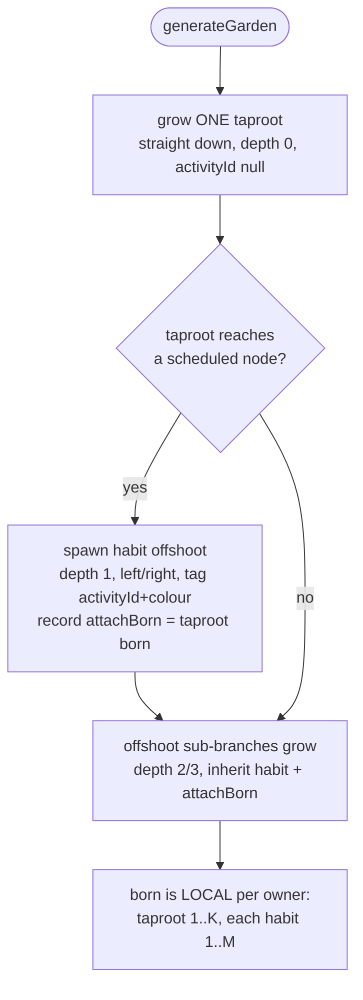
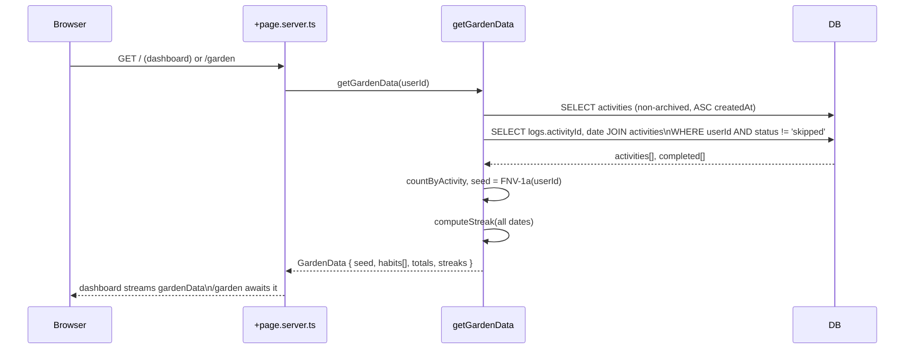
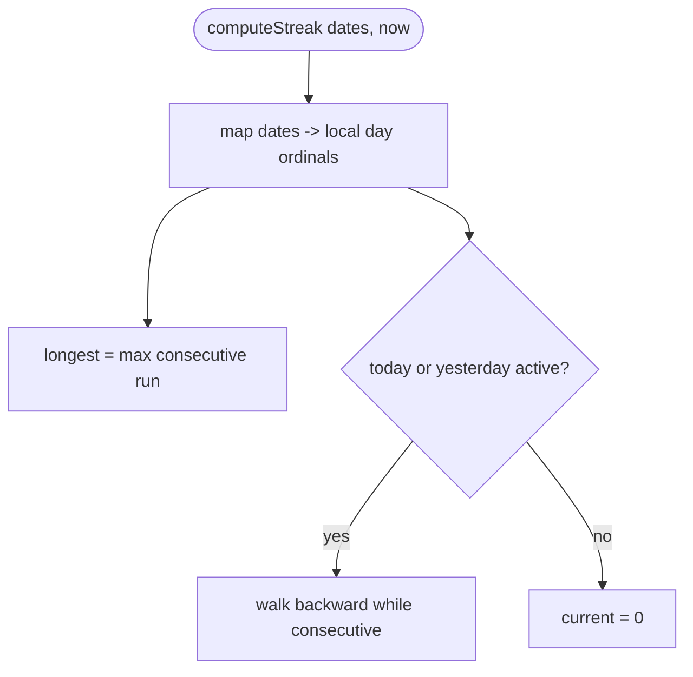
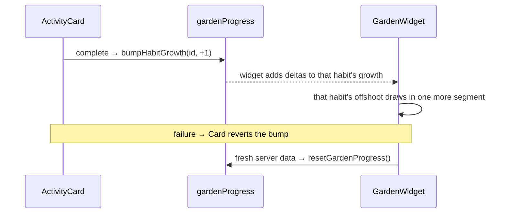

# Root System — Gamified Garden

A procedural underground "plant" that grows as the user completes activities.
**One central taproot** (the shared foundation) with **one offshoot per habit**
branching off it — and each offshoot's length/complexity tracks _that habit's
own_ completion count. A neglected habit is a short stub (or nothing); an active
one is long and richly branched. Layered on top: a **streak** metric, per-habit
**colour tinting**, milestone **blooms**, **click-through**, and **optimistic
growth** on completion.

- **Garden widget** — a non-interactive preview embedded in the dashboard.
- **Garden route** (`/garden`) — the full, pan/zoom-able view with stats.
- **Streak** — first streak primitive in the app (none existed before).

> **Status:** v1.2 — taproot + per-habit offshoots, wired to live data. See
> [Notes & Backlog](#notes--backlog) for what's still deferred.

---

## Core Idea — Derive, Don't Persist

The generator (`src/lib/roots.ts`) is **pure and deterministic**. We **derive
everything** from existing rows — so the feature adds **zero tables and zero
columns**.

| Quantity                          | Source                                      | Why it's safe                                      |
| --------------------------------- | ------------------------------------------- | -------------------------------------------------- |
| tree `seed`                       | FNV-1a hash of the **userId**               | One stable shared tree per user; never reshuffles. |
| per-habit offshoot length         | Count of that activity's non-skipped `logs` | Monotonic; raising it only _adds_ segments.        |
| `currentStreak` / `longestStreak` | Pure function over all log dates            | Recomputed each load; no drift.                    |

The whole tree is generated up-front; growth only **reveals** more of it:

- The **taproot** (depth 0, `activityId: null`) is the shared spine. It reveals
  only deep enough to host the offshoots that have grown — `max(attachBorn) + 2`
  over habits with ≥1 completion (a small base keeps a seedling stub visible).
- Each **offshoot** reveals by its **own** habit's completion count, using a
  **local** `born` (1..N within that offshoot). So revealed length == completions
  (capped at the offshoot's full size).

---

## Generator — `generateGarden(habits, { seed })`

- One taproot; habits attach as offshoots at **staggered nodes down the spine**
  (first near the surface, so little bare spine up top). Sides alternate L/R.
- The taproot does **not** branch randomly — its only branches are the scheduled
  habit offshoots. Offshoots branch organically into depth 2/3 sub-roots.
- `simulateRoot` (the original prototype loop) still backs the legacy
  `generateRootSystem` single-plant path (`activityId = null`, global born).

`Segment` gained: `activityId: string | null`, `color?: string`, and
`attachBorn?: number` (the taproot born of an offshoot's attachment node).

> **No floating roots:** an offshoot's `attachBorn` is included in the taproot's
> reveal depth whenever that habit is active, so the spine always reaches the
> node an offshoot hangs from.

---

## Data Flow

No schema change. `getGardenData` reads the user's activities + counts their
non-skipped logs per activity.

`GardenData` (`src/lib/types/garden.ts`):

| Field                             | Type            | Description                                          |
| --------------------------------- | --------------- | ---------------------------------------------------- |
| `seed`                            | `number`        | FNV-1a of userId → fixed shared-tree shape.          |
| `habits[]`                        | `GardenHabit[]` | One per non-archived activity.                       |
| `totalCompletions`                | `number`        | Lifetime non-skipped logs — root thickness + a stat. |
| `currentStreak` / `longestStreak` | `number`        | Streaks.                                             |

`GardenHabit`: `{ id, title, type, color, growth }` — `growth` is that habit's
completion count (drives its offshoot length, bloom tier, tooltip).

> Types live in `src/lib/types/garden.ts` (not the server module) so client
> components import them without tripping SvelteKit's server-only guard.

**Skipped logs are excluded** — they record intent, not work (mirrors the
dashboard's `logCountToday`).

---

## Streak Logic

Pure, unit-tested (`src/lib/streak.ts`, `streak.spec.ts`). Dedupes per local day.

**Grace window:** the current streak stays alive while **today _or_ yesterday**
has a completion; it breaks only after a full empty day. Day-granular, local
time, via `Date.UTC(y, m, d)` ordinals.

| Completion days (rel. today) | `current` |
| ---------------------------- | --------- |
| today, −1, −2                | 3         |
| −1, −2 (grace)               | 2         |
| −2, −3 (missed today+yday)   | 0         |

---

## Per-Habit Features

| Feature              | How                                                                                                                                                     |
| -------------------- | ------------------------------------------------------------------------------------------------------------------------------------------------------- |
| **Offshoot length**  | Revealed segments == habit completions (local `born`). Neglected habit → stub/none.                                                                     |
| **Colour tinting**   | Offshoot follows the habit's colour token, shaded toward parchment with depth; `zinc`/unset → brown CSS palette.                                        |
| **Milestone blooms** | Flower pops in (scale transition) at the offshoot's outermost revealed tip when its count crosses `MILESTONES = [7, 30, 100, 365]` (tier sizes petals). |
| **Click-through**    | Tap a root → `onselect(activityId, type)`: workout → `/workout/[id]`; else → `/?focus=<id>` (dashboard expands + scrolls that card).                    |
| **Tooltip**          | Hover a root → habit title + "N completed". Taproot → "Your foundation".                                                                                |

### Optimistic growth on completion

The dashboard completes activities **without** re-running its load, so server
counts stay stale until the next navigation. `src/lib/state/garden.svelte.ts`
holds per-habit `deltas`:

The widget clears deltas in an `$effect` keyed on the streamed data promise, so a
real reload replaces optimistic counts with truth (never double-counts).

---

## UI

- **`Garden.svelte`** — `generateGarden(habits, { seed })` → builds
  `growthByActivity`, `describe`, forwards `onselect` + `fitToView()`.
- **`GardenWidget.svelte`** — dashboard card; applies optimistic deltas, streak
  chip, static preview. The preview is an **`<a href="/garden">`** (reliable
  client nav; the inner roots are `pointer-events: none` so the link always wins).
- **`/garden/+page.svelte`** — interactive view, three stat cards, **Fit**,
  click-through routing, empty state when no habits.
- **`RootSystem.svelte`** — `interactive` prop (gates wheel/drag + hit-testing),
  per-habit offshoot reveal + taproot reveal depth, tinting, blooms.

**Soil backdrop:** both surfaces supply a fixed `#2a2118 → #120c06` gradient so
the earthy palette reads regardless of app theme. **Nav:** `/garden` in the
bottom bar (`Sprout` icon).

---

## Files

| File                                                                     | Role                                                    | New / Changed                         |
| ------------------------------------------------------------------------ | ------------------------------------------------------- | ------------------------------------- |
| `src/lib/roots.ts`                                                       | `generateGarden` (taproot + offshoots), `milestoneTier` | changed                               |
| `src/lib/roots.spec.ts`                                                  | Generator tests                                         | new                                   |
| `src/lib/streak.ts` + `.spec.ts`                                         | Pure streak math                                        | new                                   |
| `src/lib/types/garden.ts`                                                | `GardenData` / `GardenHabit` (shared)                   | new                                   |
| `src/lib/server/garden.ts`                                               | `getGardenData` rollup                                  | new                                   |
| `src/lib/state/garden.svelte.ts`                                         | Optimistic growth deltas                                | new                                   |
| `src/lib/components/root-system/{RootSystem,Garden,GardenWidget}.svelte` | Renderers                                               | RootSystem changed; Garden/Widget new |
| `src/routes/(app)/garden/+page.{server.ts,svelte}`                       | Full view                                               | new                                   |
| `src/lib/components/layout/Navigation.svelte`                            | Nav item                                                | changed                               |
| `src/routes/(app)/+page.server.ts`                                       | Stream `gardenData`                                     | changed                               |
| `src/lib/components/activity/Dashboard.svelte`                           | Embed widget + `?focus=`                                | changed                               |
| `src/lib/components/activity/ActivityCard.svelte`                        | Optimistic bump on toggle                               | changed                               |

> **No `db:push` required** — this feature touches no schema.

---

## Edge Cases

| Scenario                         | Behaviour                                                                                         |
| -------------------------------- | ------------------------------------------------------------------------------------------------- |
| Brand-new user (0 completions)   | Just the sprout + a 2-segment taproot stub. No offshoots.                                         |
| Habit with 0 completions         | Its offshoot is **not** revealed — only its attachment node exists on the spine.                  |
| One very active habit, rest idle | Taproot extends to reach that habit's attachment; its offshoot is long; idle habits show nothing. |
| Habit reaches 7 / 30 / 100 / 365 | A bloom (tier 1–4) appears at its offshoot tip.                                                   |
| Many habits                      | Attachments stagger down a longer taproot (capped at 16 nodes).                                   |
| Archived activity                | Excluded from `habits` — its offshoot disappears.                                                 |
| Undo a completion                | Optimistic −1 immediately (offshoot retracts a segment); server truth on next load.               |
| Complete then open `/garden`     | `/garden` fresh-loads server truth (incl. the completion); optimistic deltas are dashboard-only.  |
| Garden query fails on dashboard  | Widget shows "Garden unavailable"; activity list unaffected (separate streamed promise).          |

---

## Notes & Backlog

### Implemented

- ✅ Single taproot + one offshoot per habit (prototype-faithful organic shape).
- ✅ Offshoot length/complexity tracks the habit's own completion count.
- ✅ Accent colour tinting per habit.
- ✅ Milestone blooms (7 / 30 / 100 / 365).
- ✅ Per-habit click-through (workout detail or focused dashboard).
- ✅ Optimistic growth on completion (the right offshoot draws in instantly).

### Known limitations / still deferred

- **Streak counts _any_ completion day**, not "all scheduled done" (a "perfect
  day" streak needs per-day schedule eval over history — expensive).
- **Server-local time** for streak/grace window; thread the user's TZ if needed.
- **Bare spine above the deepest active offshoot** when only a deep habit is
  active. Truthful but can look sparse; could compact attachments by activity.
- **Offshoot length is linear in completions**, uncapped beyond the offshoot's
  generated size; no prestige/decay. Consider a curve later.
- **Full query, no cache** — pulls all non-skipped log dates + activities each
  load. Fine now; move growth to SQL `count(*) group by` + a streak rollup later.
- **Optimistic growth is dashboard-only** (completing on `/workout/[id]` reloads
  on return anyway).
- **Blooms sit at offshoot tips (underground).** Could move above ground.

### Possible enhancements (post-v1)

- Above-ground rewards (leaves/flowers at total milestones).
- Shareable garden snapshot (SVG/PNG export).
- Streak freeze / repair (forgive one missed day).
- `/stats` integration (streak history + completion heatmap).
- Seasonal / theme variants of soil + palette.
- Persist `{ seed }` only if shape must later diverge from derivation.

### Open questions for review

1. Streak semantic: "any completion" vs "perfect day"?
2. Offshoot length: linear vs accelerated/curved by streak?
3. Should blooms move above ground?
4. Where else should the streak surface — header chip? completion toast?
