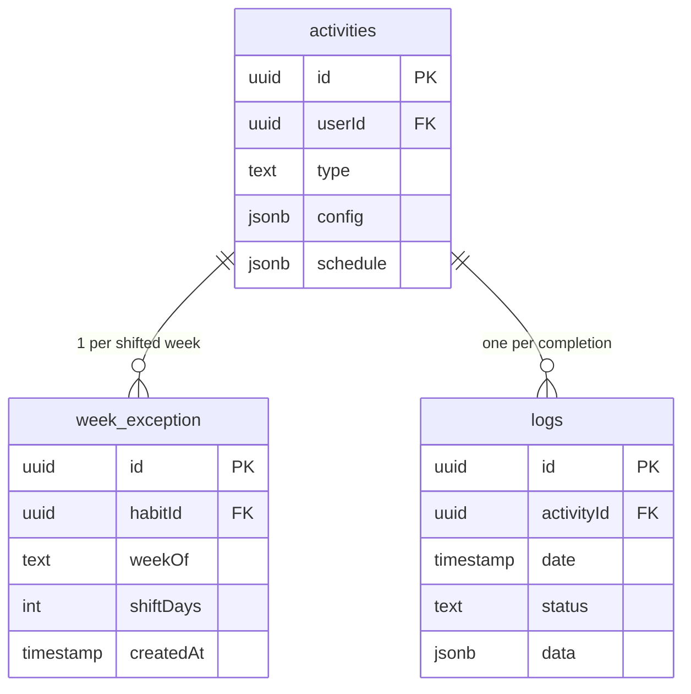
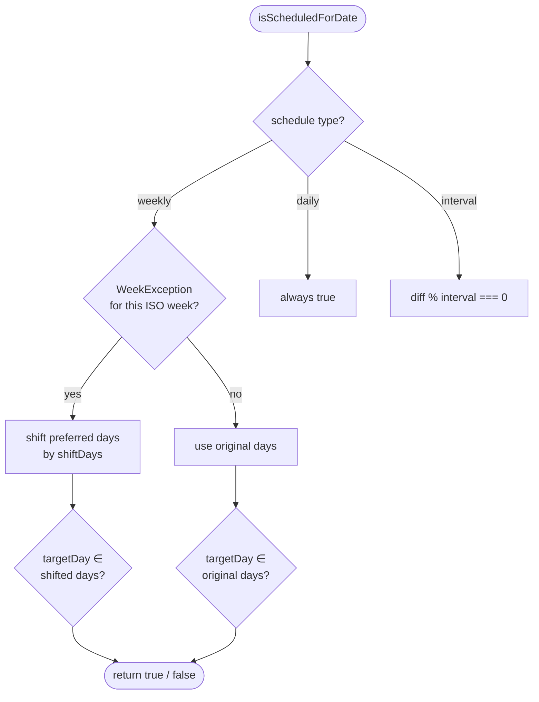
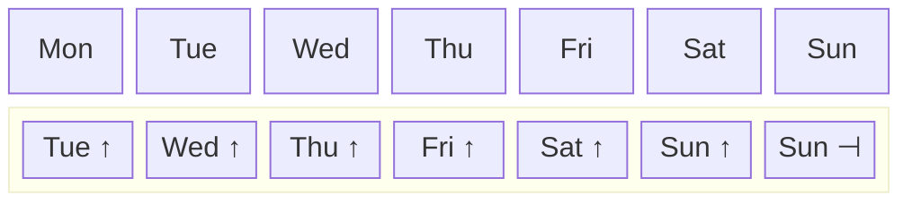
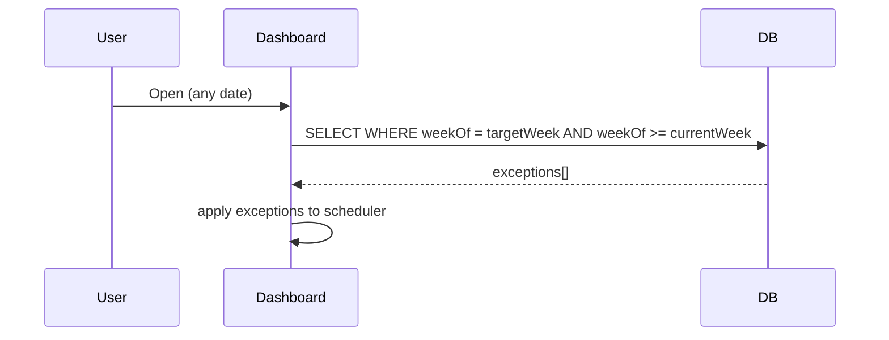
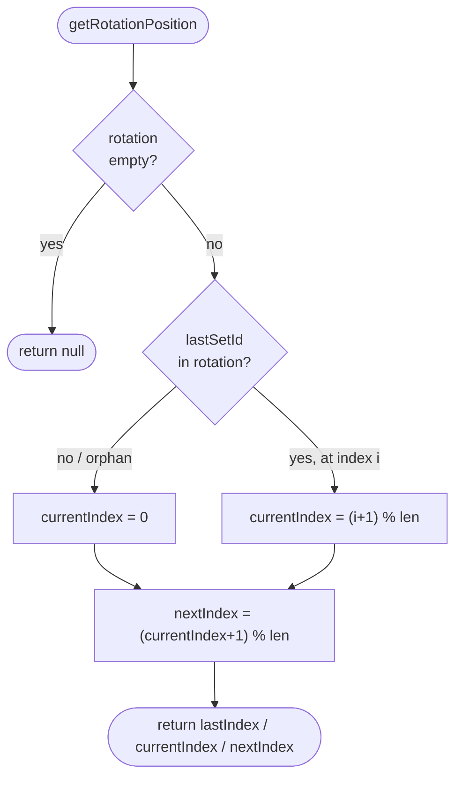
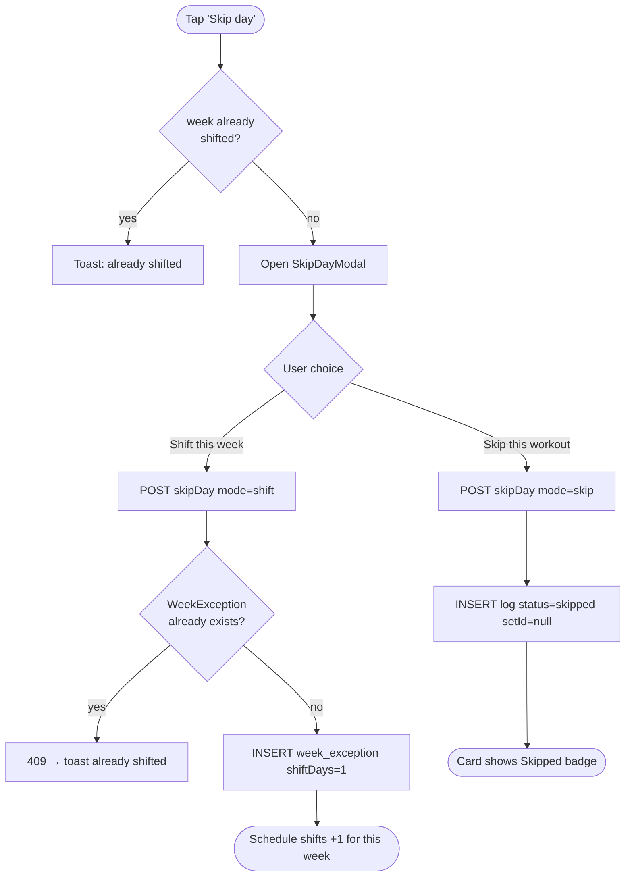
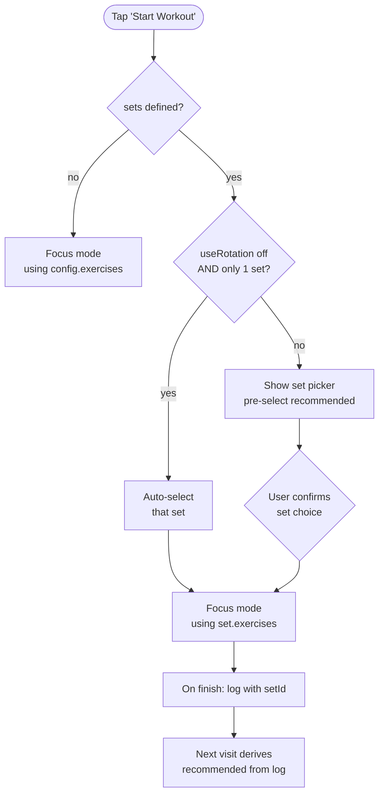
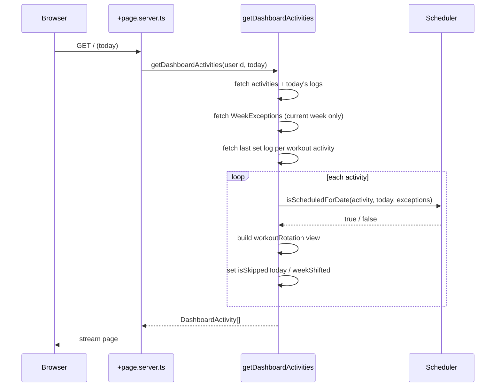
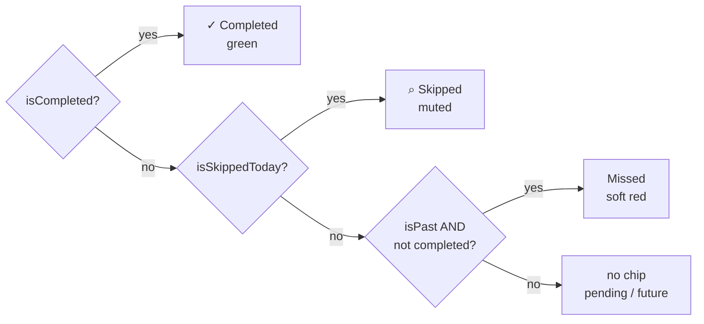

# Workout Habits — Flexible Scheduling & Set Sequencing

Two features layered on top of the existing workout habit type:

- **Week shifting** — push a week's schedule forward by one day when life gets in the way.
- **Set sequencing** — define named workout sets (Push Day, Pull Day, …) and rotate through them automatically.

---

## Data Model



`WorkoutConfig` (inside `activities.config` JSONB) carries:

| Field         | Type           | Default | Description                                                                        |
| ------------- | -------------- | ------- | ---------------------------------------------------------------------------------- |
| `workoutSets` | `WorkoutSet[]` | `[]`    | Ordered list of named sets. Empty for legacy single-list habits.                   |
| `rotation`    | `string[]`     | `[]`    | Ordered `WorkoutSet` IDs defining the cycle, e.g. `["push","pull"]`.               |
| `useRotation` | `boolean`      | `true`  | When `false`, no set is recommended at workout start — user always picks manually. |

`WorkoutSet` shape:

```ts
{
  id: string        // crypto.randomUUID()
  name: string      // e.g. "Push Day"
  exercises: Exercise[]
}
```

`WorkoutLog.data` (inside `logs.data` JSONB) gains:

| Field   | Type             | Description                                                                           |
| ------- | ---------------- | ------------------------------------------------------------------------------------- |
| `setId` | `string \| null` | Which `WorkoutSet` was completed. `null` for habits without sets or for skipped logs. |

Sequence position is **never stored** — derived at runtime from the last completed log.

`WeekException` unique constraint: `(habitId, weekOf)` — at most one shift per habit per week.

> **First deploy:** `npm run db:push` is required to create the `week_exception` table.

---

## Scheduler — Week Shifting

`isScheduledForDate(activity, targetDate, exceptions?)` in `src/lib/scheduler.ts` accepts an optional `WeekException[]`. When a matching exception is found for the target date's ISO week, the habit's weekly preferred days are shifted before the membership check.



### Clamping decision

A shift past the end of the week is **clamped to Sunday** (last entry of `WEEKDAYS = ['mon'…'sun']`). Saturday is _not_ the boundary — clamping there silently collapses distinct days (e.g. Fri + Sat both become Sat, dropping one scheduled day).



| Input           | Shift | Output                              |
| --------------- | ----- | ----------------------------------- |
| `mon, wed, fri` | +1    | `tue, thu, sat`                     |
| `wed, fri, sat` | +1    | `thu, sat, sun`                     |
| `fri, sat`      | +1    | `sat, sun`                          |
| `sat, sun`      | +1    | `sun` _(genuine boundary collapse)_ |

### Exception lifecycle



Past-week exceptions are never applied to historical schedule views. Records are cleaned up in the background on each dashboard load.

---

## Rotation Logic

Implemented as pure functions in `src/lib/workout-rotation.ts` (unit-tested).



| Scenario                              | currentIndex                |
| ------------------------------------- | --------------------------- |
| No prior log                          | `0`                         |
| `lastSetId` at index `i`              | `(i + 1) % rotation.length` |
| `lastSetId` is orphaned (set deleted) | `0` (fallback)              |

Skipped logs are **invisible to rotation** — only completed logs with a non-null `setId` advance the sequence. This means the sequence self-heals if logs are deleted or sets are reordered.

---

## User Flows

### Skip day



### Start workout (set picker)



### Dashboard data flow



---

## Dashboard Card Status Chips

Status chips are mutually exclusive, evaluated in priority order:



`isSkippedToday`: at least one `status: "skipped"` log exists for the day and zero completed logs do. Skipped logs are excluded from `logCountToday`.

---

## Edge Cases

| Scenario                       | Behaviour                                                                              |
| ------------------------------ | -------------------------------------------------------------------------------------- |
| Skip without shift             | Log with `status: "skipped"`. Rotation unaffected — skips invisible to sequence logic. |
| Shift week, already worked out | Exception applies to remaining days; past completed logs unaffected.                   |
| Shift pushes day past Sunday   | Clamped to Sunday (see Clamping decision).                                             |
| Shift when already shifted     | Server 409; toast "This week is already shifted."                                      |
| `useRotation` off              | Set picker still shows (unless ≤1 set); no Recommended badge or pre-selection.         |
| Orphaned `setId` (set deleted) | Treated as no prior log — rotation falls back to index 0.                              |
| Duplicate `WeekException`      | Prevented by unique constraint `(habitId, weekOf)`.                                    |
| Past-week exception            | Filtered by `weekOf >= currentWeek`; old records cleaned up in background.             |
| Future date on dashboard       | "Missed" chip not shown — requires `isPast` prop to be true.                           |
